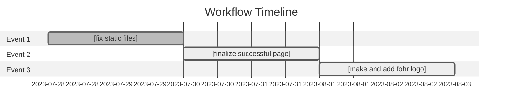

# Sabina Project

## Workflow Timeline

```mermaid
%%{init: {'theme': 'neutral'}}%%
gantt
    dateFormat  YYYY-MM-DD
    title Workflow Timeline

    section Event 1
    [fix static files]          :done,   Friday, 2023-07-28, 2d

    section Event 2
    [finalize successful page]  :active, 2023-07-30, 2d

    section Event 3
    [make and add fohr logo]    :active, 2023-08-01, 2d
```
